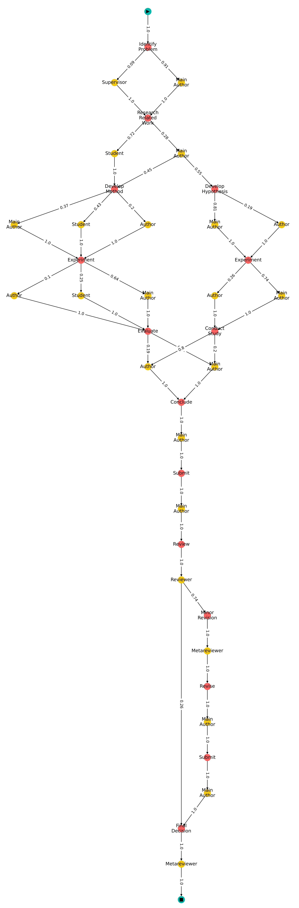
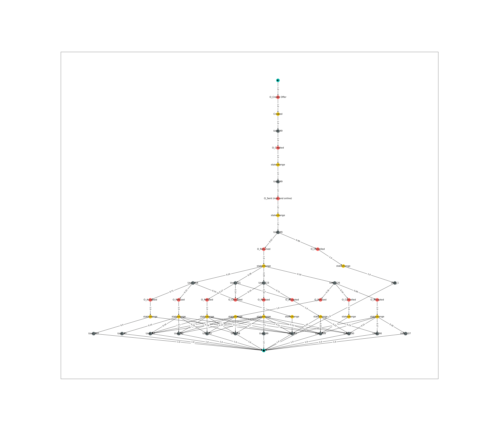
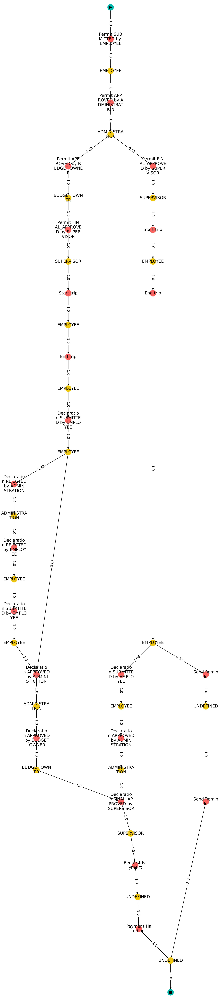
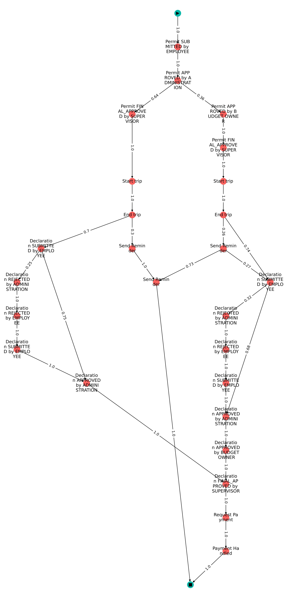

# Example Graphs
Here, we list the event attributes used, in addition to the activity, for each real-life event log:
* BPIC_2012: *org:resource*
* BPIC_2013: *impact*, *org:role*, *organization involved*
* BPIC_2015_3: *monitoringResource*, *org:resource*
* BPIC_2017_Offers: *Action*, *org:resource*
* BPIC_2020_PermitLog: *org:resource*, *org:role*

## Artificial Event Logs 

## Real-Life Event Logs

### BPIC 2012

### BPIC 2013

### BPIC 2015 3

### BPIC 2017 PermitLog

### BPIC 2020 PermitLog

